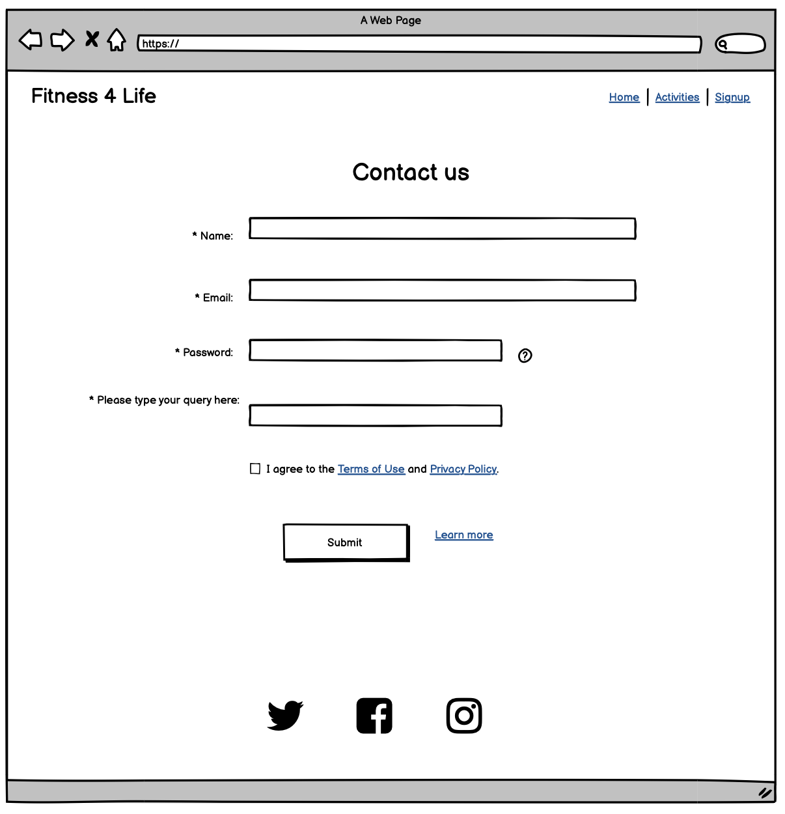
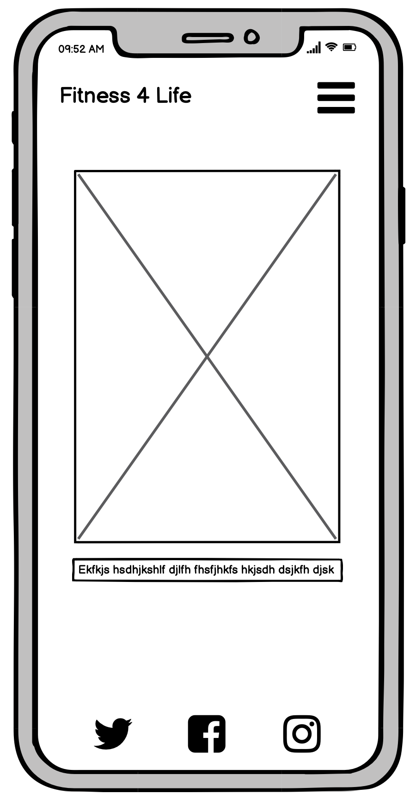

# Fitness4Life

Fitness4life is a website that advertises a multi-complex sports centre in the Brockley area of London. This is a high end sports facility offering a number of different activities including Tennis, Running, Football, Swimming and a state of the art Gym. Fitness4life gives keen sports advocates an opportunity to get an insight to each individual activity on offer and a breakdown of membership prices and sign up.

# UX

The site is fresh and easy to navigate with simple but to the point information. Mostly users can find out information regarding the complex in general and also the activities that are on offer. Finally there is a contact form for the user to fill out should they have any queries about the sports centre.

## User Stories

- As a new user of this website, I want to easily see the purpose of the website and what it offers.
- As a new user of this website, I want to be able to easily see the services you offer.
- As a new user of this website, I want to be able to find out all the activities on offer easily.
- As a new user of this website, I want to be able to see what the complex looks like.
- As a new user of this website, I want to easily be able to contact you with any queries.
- As a new user of this website, I want to be able to visit your social media websites.

# Features

## Existing features

- **Navigation Bar**
    
    Featured at the top of the site across all three pages with responsive links to the Home, Activities and Signup.
    
    This will allow the user to easily navigate between pages and with each section being underlined they will be able to see which page they are using without any issues.
    
- **Homepage Image**
    
    An eye catching image of a person doing exercise in the complex with a text box in the corner to highlight the location and a short description of the business.
    
- **What do we offer**
    
    Short paragraph describing what the organisation has on offer and where exactly to find it. Google maps image to allow the user to see a pinpointed location on the map of where it is.
    
- **Footer**
    
    Footer section that has links to different social media sites for the organisation. When links are clicked they will open in a new tab.
    
- **Activities**
    
    Page provides a breakdown of each activity for the sport centre, each activity contains an image and a short description of the facilities and pricing.
- **Images**
    
    4 images of each sport provided per line with a description of the facilities and some pricing info.
    
- **Footer**
    
    Continued footer across each page to social media links to create a smooth experience.
    
- **Contact us Form**
    
    Contact form for users to fill out with general and pricing queries about the sports centre.
    

## Future Features

- A page that includes the possibility to sign up to classes and pay for subscriptions.

## Wireframes

- Homepage

- Activities

- Contact Us (formerly sign up)

- Mobile Homepage

- Mobile Activities

- Mobile Contact Us

# Typography and colour scheme

## Design

The website is clean and sleek much like what you would find at the sports centre itself. Modern easy and clean. This is transpired through the page to the user.

## Chosen Colors

#000000 for all the main content

#3a3a3a for menu hover

#ffffff for any contrasts text against a dark background

rgba(101, 118, 219, 0.7) for text box covering an image so image is still visible, also a clean colour effecrt

#252525 for any borders

#3a3a3a for social networks links

rgba(255, 255, 255, 0.87) for submit button

## Media

**Hero image -** Sleek design descriptive of the events to make users aware of the experience they will have upon entering.

**Activities -** Activities images all giving the user an insight to the sports facilities available on-site and the quality and standard of them.

**Contact us -** Contains a background image of one of the centres buildings so the user can have a view of the grounds before visiting.

# Technology

## **Languages**

[HTML5 - Wikipedia](https://en.wikipedia.org/wiki/HTML5)

[CSS - Wikipedia](https://en.wikipedia.org/wiki/CSS)

## Framework

[Google Fonts](https://fonts.google.com/)

[Font Awesome](https://fontawesome.com/)

[Pexels](https://www.pexels.com/)

[GitHub](https://github.com/)

[Gitpod](https://www.gitpod.io/)

[Balsamiq](https://balsamiq.com/)

[Google map generator](https://google-map-generator.com/)

# Testing

## Code validation

**HTML**

**CSS**

**Lighthouse tools testing**

# User story testing

1. As a new user of this website, I want to easily see the purpose of the website and what it offers.

2. As a new user of this website, I want to be able to easily see the services you offer.

3. As a new user of this website, I want to be able to find out all the activities on offer easily.

4. As a new user of this website, I want to be able to see what the complex looks like.

5. As a new user of this website, I want to easily be able to contact you with any queries.

6. As a new user of this website, I want to be able to visit your social media websites.

